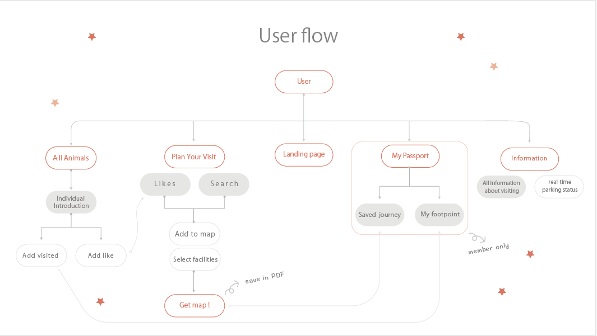

#  安心上 Zoo

 

- The website based on Taipei City Zoo. Its primary feature is to plan the best route of zoo-touring, letting user well prepared in advance.

 

 

## [Link](https://zooproject-taipei.web.app/) 🐐🦩🦬

Website Link : [https://zooproject-taipei.web.app](https://zooproject-taipei.web.app/)

Use email to log in or register a new account\
You can also use default test account below

- User: gozoo@zoo.com
- Password: gozoo1234

# 🐘 Techniques

- Front-End Fundamental
  - HTML / CSS / JavaScript
  - Responsive Web Design (RWD)
- Frameworks & Library
  - React (Hooks)
  - React Router
  - Redux
- Firebase
  - Authentication
  - Firestore
  - Hosting
- Packages
  - leaflet
  - react-leaflet
  - leaflet-routing-machine
  - Mapbox
  - graphhopper
  - OpenstreetMap
  - react-select
  - react-toastify
  - styled-components
- Other
  - CI / CD: GitHub Actions
  - Lint Tool: ESLint / Prettier
  - Version Control : Git / GitHub
  - Unit Test: Jest

# 🦛 Flow Chart

 
 
 

# 🦭Features Demo

- ### Animals overview and individual introduction

 
 
 

- ### Plan the best route of zoo-touring

 
   
 

- ### Check the collected pavilion stamps on My Passport page

 
 
 

- ### Information about the Zoo's opening and real-time parking space

 
   
 

## Future Features

- Build back-end Sever to integrate more map data into project
- Add random visiting route feature

## Contact

- Author: Aurora Huang
- E-mail: <aurora90376@gmail.com>
